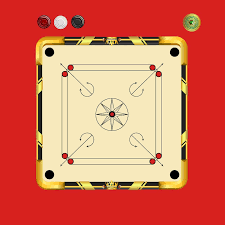
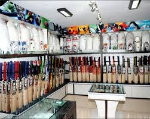

```
<!DOCTYPE html>
<html>
<head>
  <title>my website</title>
      <style>
        
        img{
            width: 50px;
        }
      </style> 
</head>
<body>

<table border="1">
    <tr>
        <th colspan="2">My Day</th>
    </tr>
    <tr>
        <td>
            <p><strong>1. wake up early</strong></p>
            <ul>
                <li>5AM</li>
                </ul>
                <ul style="list-style-type: square;">
                <li>walk</li>
                <li>jog</li>
            </ul>
        </td>
        <td rowspan="3" >
            <table border="1" width="50%" >
                <tr ><th colspan="2">Things to watch</th></tr>
                <tr>
                    <td></td>
                    <td></td>
                </tr>
                <tr>
                    <td></td>
                    <td></td>
                </tr>
            </table>
        </td>
    </tr>
    <tr>
        <td >
            <p><strong>2. breakfast</strong></p>
            <ul>
                <li>8AM</li>
                </ul>
                <ul style="list-style-type: square;">
                <li>eggs</li>
                <li>coffee</li>
            </ul>
        </td>
    </tr>
    <tr>
        <td>
            <p><strong>3. go to Saveetha</strong></p>
            <ul>
                <li>8AM</li>
                </ul>
                <ul style="list-style-type: square;">
                <li>attend classes</li>
                <li>to be continued</li>
            </ul>
        </td>
    </tr>
</table>

</body>
</html>
```

